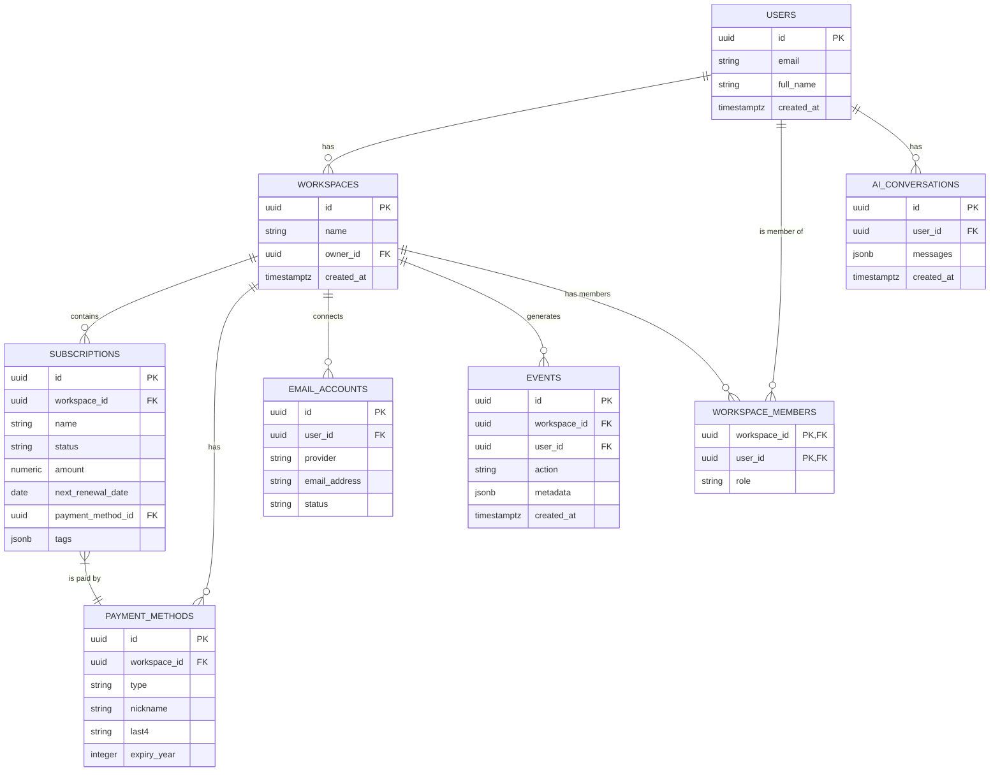

# Data Model & Schema Specification

**Version:** 1.1  
**Last Updated:** December 26, 2025

## 1. Introduction

This document provides the complete and authoritative data model specification for the Subscription Management Micro-SaaS platform. You, the AI agent, must use this specification as the single source of truth for all database schema definitions, relationships, and constraints. The schema is designed for **Supabase Postgres (v15)** and leverages its features, including Row-Level Security (RLS) and JSONB data types.

## 2. Entity-Relationship Diagram (ERD)

The following ERD illustrates the relationships between the core entities in the system.



## 3. Core Table Schemas

### 3.1. `users`

Stores user account information, primarily managed by Supabase Auth.

| Column | Type | Constraints | Description |
| :--- | :--- | :--- | :--- |
| `id` | `uuid` | PRIMARY KEY | Unique identifier from `auth.users`. |
| `email` | `text` | UNIQUE, NOT NULL | User's primary email address. |
| `full_name` | `text` | | User's full name. |
| `phone` | `text` | | Optional user phone number. |
| `created_at` | `timestamptz` | DEFAULT `now()` | Timestamp of account creation. |
| `updated_at` | `timestamptz` | DEFAULT `now()` | Timestamp of the last update. |

**RLS Policy:** Users can only read and update their own record.

### 3.2. `workspaces`

Represents a shared environment for users, families, or teams.

| Column | Type | Constraints | Description |
| :--- | :--- | :--- | :--- |
| `id` | `uuid` | PRIMARY KEY, DEFAULT `gen_random_uuid()` | Unique identifier for the workspace. |
| `name` | `text` | NOT NULL | Name of the workspace (e.g., "Family Subscriptions"). |
| `owner_id` | `uuid` | FOREIGN KEY (`users.id`) | The user who owns and manages the workspace. |
| `created_at` | `timestamptz` | DEFAULT `now()` | Timestamp of workspace creation. |

**RLS Policy:** Users can access workspaces where they are a member.

### 3.3. `subscriptions`

The core table for storing all subscription data.

| Column | Type | Constraints | Description |
| :--- | :--- | :--- | :--- |
| `id` | `uuid` | PRIMARY KEY, DEFAULT `gen_random_uuid()` | Unique identifier for the subscription. |
| `workspace_id` | `uuid` | FOREIGN KEY (`workspaces.id`), NOT NULL | The workspace this subscription belongs to. |
| `name` | `text` | NOT NULL | The service name (e.g., "Netflix"). |
| `status` | `text` | NOT NULL | e.g., `active`, `trial_pending`, `trial_active`, `paused`, `cancelled`. |
| `amount` | `numeric` | | The cost of the subscription. |
| `currency` | `text` | DEFAULT `'USD'` | 3-letter currency code. |
| `billing_period` | `text` | | e.g., `monthly`, `annual`, `custom`. |
| `next_renewal_date` | `date` | | The date of the next scheduled payment. |
| `payment_method_id` | `uuid` | FOREIGN KEY (`payment_methods.id`) | The payment method used for this subscription. |
| `tags` | `jsonb` | DEFAULT `'[]'` | An array of custom text tags. |
| `notes` | `text` | | User-provided notes. |
| `is_private` | `boolean` | DEFAULT `false` | If true, visible only to the owner in a shared workspace. |
| `source` | `text` | | How the subscription was added: `manual`, `email_detected`, `import`. |
| `created_at` | `timestamptz` | DEFAULT `now()` | Timestamp of creation. |

**RLS Policy:** Users can access subscriptions in their workspaces, respecting the `is_private` flag.

### 3.4. `email_accounts`

Securely stores credentials and metadata for connected email accounts.

| Column | Type | Constraints | Description |
| :--- | :--- | :--- | :--- |
| `id` | `uuid` | PRIMARY KEY, DEFAULT `gen_random_uuid()` | Unique identifier for the connected email account. |
| `user_id` | `uuid` | FOREIGN KEY (`users.id`), NOT NULL | The user who connected this account. |
| `provider` | `text` | NOT NULL | e.g., `gmail`, `outlook`, `icloud`. |
| `email_address` | `text` | NOT NULL | The email address of the connected account. |
| `access_token_enc` | `text` | | Encrypted OAuth access token. |
| `refresh_token_enc` | `text` | | Encrypted OAuth refresh token. |
| `imap_password_enc` | `text` | | Encrypted app-specific password for iCloud. |
| `status` | `text` | DEFAULT `'active'` | e.g., `active`, `error`, `revoked`. |
| `last_checked_at` | `timestamptz` | | Timestamp of the last email check. |

**Security Note:** All token and password fields **must** be encrypted at rest before being stored.

### 3.5. `ai_conversations`

Stores the history of conversations with the AI support assistant.

| Column | Type | Constraints | Description |
| :--- | :--- | :--- | :--- |
| `id` | `uuid` | PRIMARY KEY, DEFAULT `gen_random_uuid()` | Unique identifier for the conversation. |
| `user_id` | `uuid` | FOREIGN KEY (`users.id`), NOT NULL | The user participating in the conversation. |
| `messages` | `jsonb` | NOT NULL | An array of message objects (e.g., `[{role: 'user', content: '...'}, {role: 'assistant', content: '...'}]`). |
| `created_at` | `timestamptz` | DEFAULT `now()` | Timestamp of conversation start. |

**RLS Policy:** Users can only access their own conversations.

### 3.6. `events`

Provides an audit trail of important actions within the system.

| Column | Type | Constraints | Description |
| :--- | :--- | :--- | :--- |
| `id` | `uuid` | PRIMARY KEY, DEFAULT `gen_random_uuid()` | Unique identifier for the event. |
| `workspace_id` | `uuid` | FOREIGN KEY (`workspaces.id`) | The workspace where the event occurred. |
| `user_id` | `uuid` | FOREIGN KEY (`users.id`) | The user who initiated the event. |
| `action` | `text` | NOT NULL | The action performed (e.g., `subscription.create`, `email.connect`). |
| `metadata` | `jsonb` | | Additional context about the event. |
| `created_at` | `timestamptz` | DEFAULT `now()` | Timestamp of the event. |

**RLS Policy:** Users can only view events related to their own workspaces.

## 4. Indexes for Performance

You must create the following indexes to ensure optimal query performance:

*   `subscriptions(workspace_id)`
*   `subscriptions(payment_method_id)`
*   `subscriptions(next_renewal_date)`
*   `subscriptions(status)`
*   `email_accounts(user_id)`
*   `events(workspace_id, created_at DESC)`

## 5. Sample RLS Policies

### 5.1. `subscriptions` Table

This policy ensures that users can only view subscriptions in workspaces they are a member of, and that private subscriptions are only visible to the workspace owner.

```sql
CREATE POLICY "Enable read access for workspace members" ON subscriptions
FOR SELECT USING (
  workspace_id IN (
    SELECT workspace_id FROM workspace_members WHERE user_id = auth.uid()
  )
  AND (is_private = false OR workspace_id IN (
    SELECT id FROM workspaces WHERE owner_id = auth.uid()
  ))
);
```

### 5.2. `workspaces` Table

This policy allows users to see workspaces they belong to.

```sql
CREATE POLICY "Enable read access for workspace members" ON workspaces
FOR SELECT USING (
  id IN (
    SELECT workspace_id FROM workspace_members WHERE user_id = auth.uid()
  )
);
```

## 6. Migration Strategy

All schema changes must be managed through **Supabase Migrations**. You must create a new migration file in the `supabase/migrations` directory for each change. Migration files must be named with a timestamp prefix (e.g., `20251226000000_create_subscriptions_table.sql`) to ensure they are applied in the correct order. All migrations must be idempotent and, where possible, reversible.
