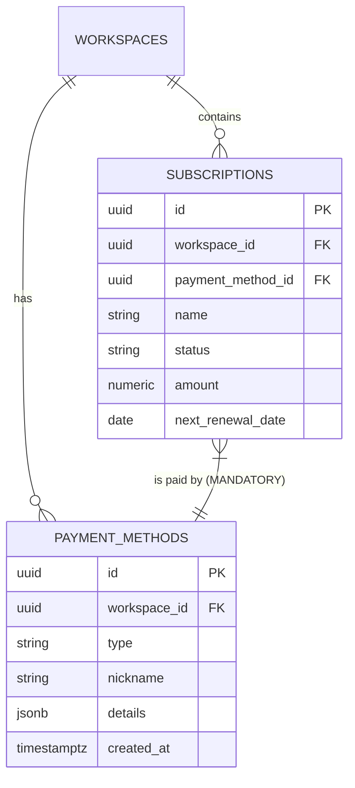

# Data Model & Schema Specification

**Version:** 1.3
**Last Updated:** December 26, 2025

## 1. Introduction

This document provides the complete and authoritative data model specification for the Subscription Management Micro-SaaS platform. You, the AI agent, must use this specification as the single source of truth for all database schema definitions, relationships, and constraints. The schema is designed for **Supabase Postgres (v15)** and leverages its features, including Row-Level Security (RLS).

## 2. Entity-Relationship Diagram (ERD)



## 3. Core Table Schemas

### 3.1. `payment_methods` (Revised)

This table stores all user-defined payment methods, including cards and connected wallets. It is designed to be generic to support various types.

| Column | Type | Constraints | Description |
| :--- | :--- | :--- | :--- |
| `id` | `uuid` | PRIMARY KEY, DEFAULT `gen_random_uuid()` | Unique identifier for the payment method. |
| `workspace_id` | `uuid` | FOREIGN KEY (`workspaces.id`), NOT NULL | The workspace this method belongs to. |
| `type` | `text` | NOT NULL | The type of payment method (e.g., `card`, `paypal`, `apple_pay`). |
| `nickname` | `text` | NOT NULL | A user-friendly name for the method (e.g., "Personal Visa", "Business PayPal"). |
| `details` | `jsonb` | NOT NULL | A JSON object containing type-specific details. |
| `created_at` | `timestamptz` | DEFAULT `now()` | Timestamp of creation. |

**JSONB `details` Examples:**

*   **For `type: 'card'`:**
    ```json
    {
      "last4": "4242",
      "expiry_month": 12,
      "expiry_year": 2028,
      "brand": "Visa"
    }
    ```
*   **For `type: 'paypal'`:**
    ```json
    {
      "email": "user@example.com"
    }
    ```

**RLS Policy:** Users can only access payment methods in workspaces they are a member of.

### 3.2. `subscriptions` (Updated)

The core table for storing all subscription data. The link to a payment method is now mandatory.

| Column | Type | Constraints | Description |
| :--- | :--- | :--- | :--- |
| `id` | `uuid` | PRIMARY KEY, DEFAULT `gen_random_uuid()` | Unique identifier for the subscription. |
| `workspace_id` | `uuid` | FOREIGN KEY (`workspaces.id`), NOT NULL | The workspace this subscription belongs to. |
| `payment_method_id` | `uuid` | FOREIGN KEY (`payment_methods.id`), **NOT NULL** | **Mandatory:** The payment method used for this subscription. |
| `name` | `text` | NOT NULL | The service name (e.g., "Netflix"). |
| `status` | `text` | NOT NULL | e.g., `active`, `trial_active`, `cancelled`. |
| `amount` | `numeric` | | The cost of the subscription. |

*(Other columns remain the same as v1.2)*

**RLS Policy:** Users can access subscriptions in their workspaces, respecting the `is_private` flag.

*(All other tables from v1.2 remain the same, including `pending_imports` and `integrations`.)*

## 4. Key Relationship: Mandatory Linking

It is a strict business rule that every subscription must be associated with a payment method. The `subscriptions.payment_method_id` column is non-nullable. When a user creates a subscription, they **must** select a payment method from their existing list or be prompted to add a new one. This ensures data integrity and enables the critical filtering functionality.

## 5. Migration Strategy

All schema changes must be managed through **Supabase Migrations**.

1.  You must create a new migration file to modify the `payment_methods` table to use the generic `jsonb` details field.
2.  You must update the `subscriptions` table to make the `payment_method_id` column `NOT NULL`.
    *   **Important:** For existing databases, this migration will require a data backfill to ensure all existing subscriptions have a valid `payment_method_id` before the constraint is applied.
