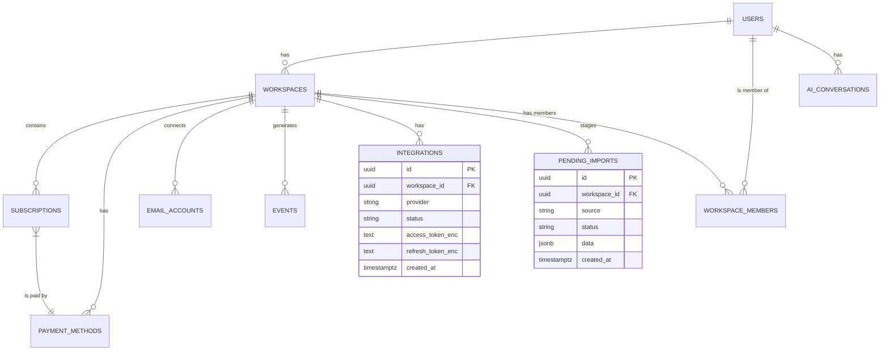

# Data Model & Schema Specification

**Version:** 1.2  
**Last Updated:** December 26, 2025

## 1. Introduction

This document provides the complete and authoritative data model specification for the Subscription Management Micro-SaaS platform. You, the AI agent, must use this specification as the single source of truth for all database schema definitions, relationships, and constraints. The schema is designed for **Supabase Postgres (v15)** and leverages its features, including Row-Level Security (RLS) and JSONB data types.

## 2. Entity-Relationship Diagram (ERD)

## 3. Core Table Schemas

### 3.1. `pending_imports` (New)

This table serves as a temporary staging area for potential subscriptions identified from statement uploads or wallet integrations. Records in this table are meant to be short-lived, pending user confirmation.

| Column | Type | Constraints | Description |
| :--- | :--- | :--- | :--- |
| `id` | `uuid` | PRIMARY KEY, DEFAULT `gen_random_uuid()` | Unique identifier for the pending import batch. |
| `workspace_id` | `uuid` | FOREIGN KEY (`workspaces.id`), NOT NULL | The workspace this import belongs to. |
| `source` | `text` | NOT NULL | The source of the import (e.g., `statement_upload`, `paypal_oauth`). |
| `status` | `text` | DEFAULT `pending_review` | The status of the import (e.g., `pending_review`, `completed`). |
| `data` | `jsonb` | NOT NULL | An array of suggested subscription objects (e.g., `[{merchant: "Netflix", amount: 15.99, date: "2025-12-15"}]`). |
| `created_at` | `timestamptz` | DEFAULT `now()` | Timestamp of creation. |

**RLS Policy:** Users can only access pending imports for workspaces they are a member of.

### 3.2. `integrations` (New)

Securely stores credentials for third-party integrations that use OAuth 2.0, such as PayPal.

| Column | Type | Constraints | Description |
| :--- | :--- | :--- | :--- |
| `id` | `uuid` | PRIMARY KEY, DEFAULT `gen_random_uuid()` | Unique identifier for the integration. |
| `workspace_id` | `uuid` | FOREIGN KEY (`workspaces.id`), NOT NULL | The workspace this integration belongs to. |
| `provider` | `text` | NOT NULL | The provider name (e.g., `paypal`). |
| `status` | `text` | DEFAULT `active` | The status of the integration (e.g., `active`, `revoked`, `error`). |
| `access_token_enc` | `text` | NOT NULL | Encrypted OAuth access token. |
| `refresh_token_enc` | `text` | | Encrypted OAuth refresh token. |
| `created_at` | `timestamptz` | DEFAULT `now()` | Timestamp of creation. |

**Security Note:** All token fields **must** be encrypted at rest before being stored.

**RLS Policy:** Users can only access integrations for workspaces they are a member of.

### 3.3. `subscriptions` (Updated)

| Column | Type | Constraints | Description |
| :--- | :--- | :--- | :--- |
| `source` | `text` | | How the subscription was added: `manual`, `email_detected`, `statement_import`, `wallet_import`. |

*(Other columns remain the same)*

*(All other tables from v1.1 remain the same)*

## 4. Indexes for Performance

*   `pending_imports(workspace_id)`
*   `integrations(workspace_id)`

*(Other indexes remain the same)*

## 5. Migration Strategy

All schema changes must be managed through **Supabase Migrations**. You must create two new migration files:

1.  `..._create_pending_imports_table.sql`
2.  `..._create_integrations_table.sql`

These migrations must be idempotent and include the necessary RLS policies.
