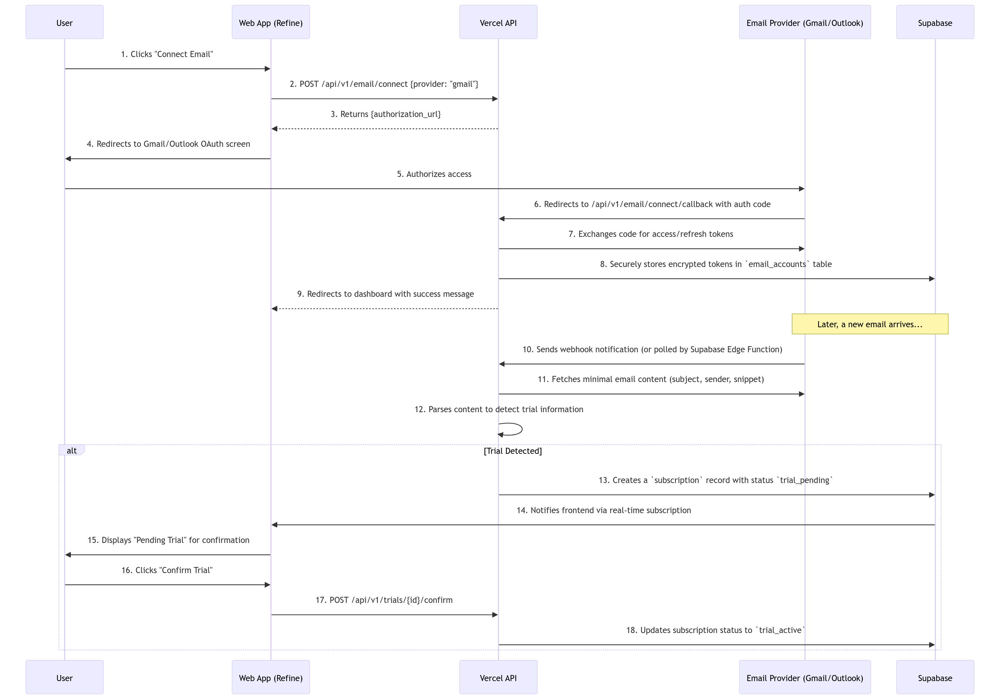

# Email Trial Detection Implementation Guide

## 1. Introduction

This document provides detailed implementation guidance for the email-based trial detection feature. You, the AI agent, must follow this specification when implementing email integration and trial parsing functionality.

## 2. Supported Email Providers

### 2.1. Gmail

*   **Authentication:** OAuth 2.0
*   **Required Scope:** `https://www.googleapis.com/auth/gmail.readonly`
*   **API:** Gmail API v1
*   **Notification Method:** Gmail Push Notifications via Google Cloud Pub/Sub

### 2.2. Microsoft Outlook

*   **Authentication:** OAuth 2.0 via Azure AD
*   **Required Scope:** `Mail.Read`
*   **API:** Microsoft Graph API
*   **Notification Method:** Microsoft Graph Change Notifications (webhooks)

### 2.3. iCloud Mail

*   **Authentication:** App-specific password
*   **Protocol:** IMAP
*   **Notification Method:** Polling via Supabase Edge Function (every 5-15 minutes)

## 3. Implementation Architecture



## 4. Gmail Integration

### 4.1. OAuth Flow

1.  User clicks "Connect Gmail" in the application.
2.  Application redirects to Google OAuth consent screen.
3.  User authorizes the application.
4.  Google redirects back with an authorization code.
5.  Application exchanges the code for access and refresh tokens.
6.  Tokens are encrypted and stored in the `email_accounts` table.

### 4.2. Setting Up Push Notifications

You must implement the following steps to set up Gmail push notifications:

1.  Create a Google Cloud Pub/Sub topic (e.g., `gmail-notifications`).
2.  Create a subscription for the topic that points to your webhook endpoint.
3.  Use the Gmail API `watch()` method to register the user's mailbox for notifications:

```javascript
const response = await gmail.users.watch({
  userId: 'me',
  requestBody: {
    topicName: 'projects/YOUR_PROJECT_ID/topics/gmail-notifications',
    labelIds: ['INBOX']
  }
});
```

4.  Store the `historyId` from the response for incremental sync.

### 4.3. Processing Gmail Notifications

When a notification is received at your webhook:

1.  Decode the Pub/Sub message.
2.  Extract the `historyId`.
3.  Use the Gmail API `history.list()` method to get new messages since the last `historyId`.
4.  For each new message, fetch the message details using `messages.get()`.
5.  Pass the message to the Email Parser Service.

## 5. Outlook Integration

### 5.1. OAuth Flow

1.  User clicks "Connect Outlook" in the application.
2.  Application redirects to Azure AD OAuth consent screen.
3.  User authorizes the application.
4.  Azure AD redirects back with an authorization code.
5.  Application exchanges the code for access and refresh tokens.
6.  Tokens are encrypted and stored in the `email_accounts` table.

### 5.2. Setting Up Change Notifications

You must use the Microsoft Graph API to create a subscription:

```javascript
const subscription = await graphClient
  .api('/subscriptions')
  .post({
    changeType: 'created',
    notificationUrl: 'https://your-app.com/api/email/webhook/outlook',
    resource: '/me/mailFolders/inbox/messages',
    expirationDateTime: new Date(Date.now() + 3600000).toISOString(),
    clientState: 'secretClientState'
  });
```

**Important:** Microsoft Graph subscriptions expire after a maximum of 3 days. You must implement a renewal mechanism using a Supabase Edge Function that runs daily.

### 5.3. Processing Outlook Notifications

When a notification is received at your webhook:

1.  Verify the `clientState` matches your secret.
2.  For validation requests, return the `validationToken`.
3.  For change notifications, extract the message IDs.
4.  Use the Graph API to fetch message details.
5.  Pass the message to the Email Parser Service.

## 6. iCloud Integration

### 6.1. User Setup

1.  User clicks "Connect iCloud" in the application.
2.  Application displays instructions for creating an app-specific password.
3.  User enters their iCloud email and app-specific password.
4.  Application tests the IMAP connection.
5.  Credentials are encrypted and stored in the `email_accounts` table.

### 6.2. IMAP Polling

You must create a Supabase Edge Function that runs every 5-15 minutes:

```typescript
import { createClient } from '@supabase/supabase-js';
import Imap from 'imap';

export async function pollICloudEmail(emailAccountId: string) {
  // 1. Fetch email account credentials from database
  // 2. Connect to iCloud IMAP server (imap.mail.me.com:993)
  // 3. Search for unread messages since last_checked_at
  // 4. Fetch message details
  // 5. Pass to Email Parser Service
  // 6. Update last_checked_at
}
```

## 7. Email Parser Service

### 7.1. Trial Detection Logic

The parser must identify trial-related emails using the following heuristics:

**Primary Keywords:**

*   "free trial"
*   "trial period"
*   "trial has started"
*   "trial ends"
*   "trial will expire"
*   "your trial"
*   "start your trial"

**Secondary Indicators:**

*   Phrases like "X-day trial", "30 days free", "7-day free trial"
*   Date patterns near trial keywords
*   Price information with "after trial" or "then $X/month"

### 7.2. Information Extraction

You must extract the following information from trial emails:

**Service Name:**

*   Extract from sender name (e.g., "Spotify" from "noreply@spotify.com")
*   Extract from subject line (e.g., "Welcome to your Canva Pro trial")
*   Use a mapping table for known brands

**Trial End Date:**

*   Look for explicit dates (e.g., "ends on January 15, 2024")
*   Calculate from duration (e.g., "7-day trial" → email date + 7 days)
*   If not found, set to null and prompt user to enter manually

**Post-Trial Price (Optional):**

*   Look for phrases like "then $X/month" or "you'll be charged $X"
*   Extract numeric amount and billing period

### 7.3. Parsing Implementation

```typescript
interface TrialInfo {
  serviceName: string | null;
  trialStartDate: Date;
  trialEndDate: Date | null;
  postTrialPrice: number | null;
  billingPeriod: string | null;
  confidence: number; // 0-1
}

export function parseTrialEmail(
  subject: string,
  body: string,
  sender: string,
  receivedDate: Date
): TrialInfo | null {
  // 1. Check for trial keywords
  const hasTrial = checkTrialKeywords(subject, body);
  if (!hasTrial) return null;

  // 2. Extract service name
  const serviceName = extractServiceName(subject, sender);

  // 3. Extract trial end date
  const trialEndDate = extractTrialEndDate(body, receivedDate);

  // 4. Extract post-trial price
  const { price, period } = extractPostTrialPrice(body);

  return {
    serviceName,
    trialStartDate: receivedDate,
    trialEndDate,
    postTrialPrice: price,
    billingPeriod: period,
    confidence: calculateConfidence(serviceName, trialEndDate)
  };
}
```

## 8. Creating Pending Trials

When a trial is detected, you must:

1.  Check for duplicates (same service name and similar dates).
2.  Create a record in the `subscriptions` table with `status = 'trial_pending'`.
3.  Create a notification for the user.

```sql
INSERT INTO subscriptions (
  workspace_id,
  name,
  status,
  trial_start_date,
  trial_end_date,
  amount,
  billing_period,
  source,
  created_at
) VALUES (
  $1, $2, 'trial_pending', $3, $4, $5, $6, 'email_detected', NOW()
);
```

## 9. User Confirmation Flow

### 9.1. Notification

Send a notification to the user via:

*   In-app notification
*   Web push notification
*   Email (optional)

**Message Template:**

> "We found a free trial: **{Service Name}**, ending **{Date}**. Would you like to track it?"

### 9.2. Confirmation UI

The confirmation page must display:

*   Service name (editable)
*   Trial start date (editable)
*   Trial end date (editable)
*   Post-trial price (editable, optional)
*   Billing period (editable, optional)
*   Actions: "Confirm", "Edit & Confirm", "Dismiss"

### 9.3. Confirmation Action

When the user confirms:

1.  Update the subscription status to `'trial_active'`.
2.  Create reminder notifications based on user preferences.
3.  Add the trial to the user's subscription list.

## 10. Error Handling

### 10.1. Token Expiration

If an OAuth token expires or is revoked:

1.  Update the email account status to `'error'`.
2.  Display a notification to the user: "Please reconnect your {Provider} account."
3.  Stop polling/watching until the user reconnects.

### 10.2. Parsing Failures

If the parser cannot extract sufficient information:

1.  Create a pending trial with null values.
2.  Prompt the user to fill in the missing information manually.

### 10.3. Duplicate Detection

Before creating a pending trial, check for existing trials with:

*   Same service name (case-insensitive, fuzzy match)
*   Overlapping date range (±7 days)

If a duplicate is found, skip creating a new pending trial.

## 11. Privacy and Data Retention

You must adhere to the following privacy guidelines:

*   **Do not store full email bodies.** Only store the extracted metadata.
*   Store only the minimum necessary information: service name, dates, and price.
*   Store the email message ID for debugging purposes only.
*   Implement a data retention policy: delete email-related metadata after 90 days.

## 12. Testing

You must create test cases for:

*   Parsing emails from popular services (Netflix, Spotify, Canva, etc.)
*   Handling emails with missing information
*   Duplicate detection
*   Token expiration and renewal
*   Webhook validation and processing
