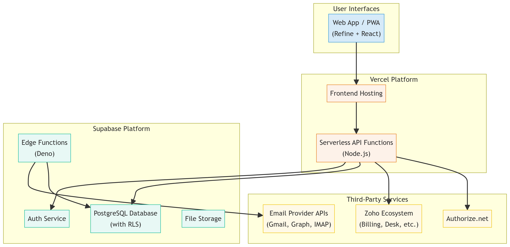

# System Architecture & Technical Design

**Version:** 1.1  
**Last Updated:** December 26, 2025

## 1. Architectural Vision & Principles

The architecture of the Subscription Management Micro-SaaS is founded on modern, cloud-native principles to ensure **scalability, security, resilience, and maintainability**. Our goal is to create a robust, AI-driven platform that can be efficiently operated and evolved by a small team of engineers and AI agents.

Key architectural principles include:

*   **Serverless-First:** We leverage serverless computing to eliminate infrastructure management, enable automatic scaling, and optimize operational costs.
*   **Managed Services:** We prioritize the use of managed services (e.g., Supabase, Vercel, Zoho) to reduce operational burden and focus on delivering core product value.
*   **AI-First Operations:** The system is designed for high-touch automation, where AI agents are first-class citizens in the development, deployment, and maintenance lifecycle.
*   **Security by Design:** Security is not an afterthought. It is integrated into every layer of the architecture, from database row-level security to API authentication and secure third-party integrations.
*   **Modularity & Decoupling:** Components are designed to be modular and loosely coupled, enabling independent development, deployment, and scaling.

## 2. High-Level System Architecture

The following diagram provides a high-level overview of the system's components and their interactions.

## 3. Component Breakdown

### 3.1. Frontend Layer

*   **Framework:** **Refine (v3)** on **React (v18)**. Refine is chosen for its powerful data-fetching capabilities, routing, and state management abstractions, which accelerate development.
*   **Styling:** **Tailwind CSS (v3)** with the **Metronic** theme. This provides a professional, consistent, and responsive UI out-of-the-box.
*   **Hosting:** The frontend is a Single-Page Application (SPA) deployed and hosted on **Vercel**. Vercel provides a global CDN, automatic deployments, and seamless integration with our serverless backend.
*   **Application Shells:** For Android and macOS, we will use thin native wrappers (e.g., Capacitor or a simple WebView) around the PWA to provide a native-like installation experience and access to native push notifications.

### 3.2. Backend & API Layer

*   **API Gateway:** **Vercel Serverless Functions** act as our primary API gateway. These are Node.js functions that handle incoming requests, perform business logic, and interact with backend services.
*   **Backend Platform:** **Supabase** serves as our core backend-as-a-service (BaaS) platform. It provides:
    *   **Database:** A managed **PostgreSQL (v15)** database with Row-Level Security (RLS) enabled for strict multi-tenant data isolation.
    *   **Authentication:** Supabase Auth for secure user authentication, social logins, and JWT-based session management.
    *   **Background Jobs:** Supabase Edge Functions (Deno-based) are used for scheduled and event-driven background tasks, such as polling iCloud emails or sending reminder notifications.
    *   **Storage:** Supabase Storage for securely storing any user-generated files (e.g., imported documents, avatars).

## 4. Data Flow & Logic

### 4.1. User Authentication Flow

1.  User signs up or logs in via the Refine frontend.
2.  The frontend communicates with Supabase Auth to handle the authentication process.
3.  Upon successful authentication, Supabase Auth issues a JWT.
4.  The frontend stores the JWT and includes it in the `Authorization` header of all subsequent API requests to Vercel.
5.  The Vercel API gateway validates the JWT with Supabase before processing the request.

### 4.2. Email Trial Detection Flow

1.  **Connection:** User initiates an OAuth 2.0 flow from the frontend to connect their Gmail or Outlook account. For iCloud, they provide an app-specific password.
2.  **Notification:**
    *   **Gmail:** A Google Pub/Sub notification is sent to a Vercel webhook when a new email arrives.
    *   **Outlook:** A Microsoft Graph webhook is triggered.
    *   **iCloud:** A Supabase Edge Function polls the IMAP server periodically.
3.  **Processing:** The Vercel webhook or Supabase Edge Function receives the event and fetches the minimal necessary email content (subject, sender, snippet).
4.  **Parsing:** The content is passed to a dedicated parsing service (another serverless function) that uses NLP and pattern matching to identify trial information.
5.  **Storage & Confirmation:** If a trial is detected, a `trial_pending` record is created in the Supabase database, and the user is notified to confirm the trial.

## 5. Technology Versions

To ensure consistency and avoid conflicts, all development must adhere to the following technology versions:

| Technology | Version |
| :--- | :--- |
| React | 18.2.0 |
| Refine | 3.x |
| Tailwind CSS | 3.3.x |
| Node.js (Vercel) | 18.x |
| PostgreSQL (Supabase) | 15.x |
| Deno (Supabase Edge Functions) | 1.x |

## 6. Rationale for Key Technology Choices

*   **Refine:** Chosen over vanilla React or Next.js for its built-in data provider, routing, and auth integration, which significantly reduces boilerplate and accelerates development of this data-intensive application.
*   **Supabase:** Chosen over a self-hosted Postgres or other BaaS solutions for its integrated auth, edge functions, and excellent RLS capabilities, which are critical for our multi-tenant security model.
*   **Vercel:** Chosen for its seamless developer experience, tight integration with Next.js/React, and high-performance global edge network, which is ideal for our user-facing application.
