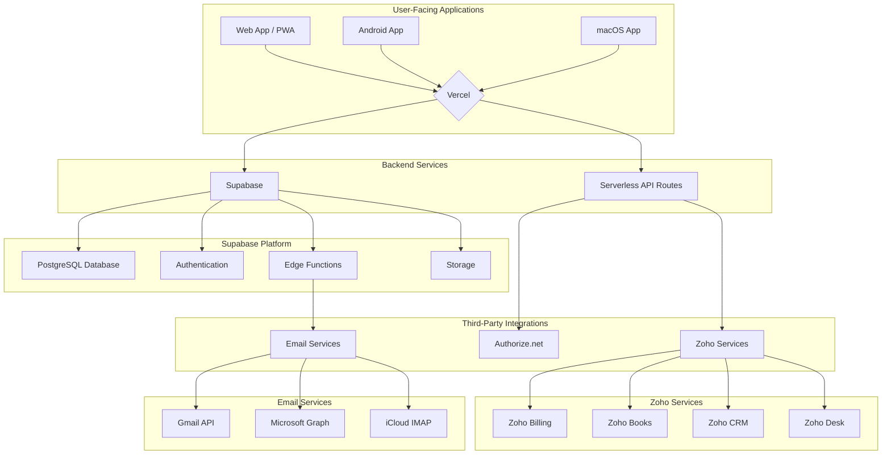
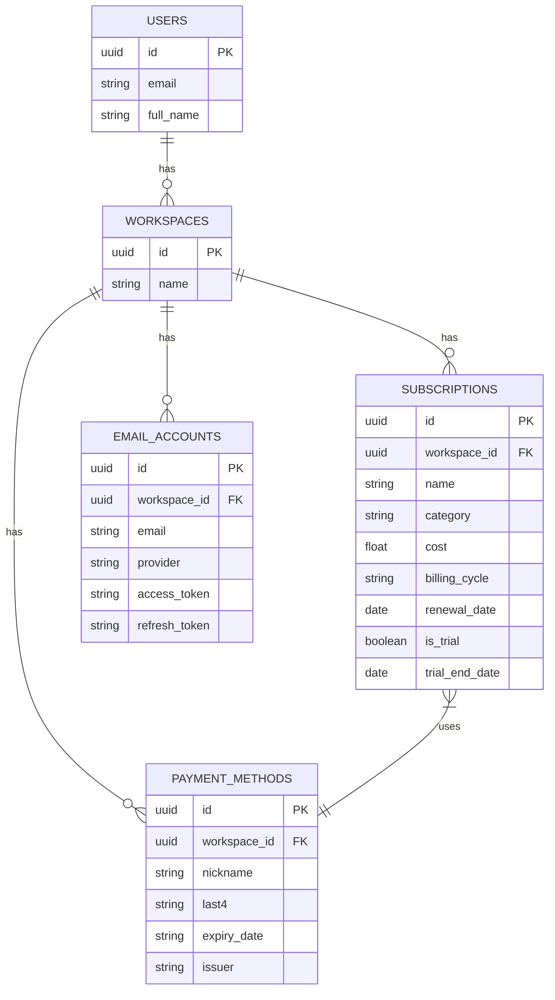

# System Architecture & Technical Design

## 1. High-Level Architecture

The Subscription Management Micro-SaaS platform is designed with a modern, serverless architecture to ensure scalability, security, and maintainability. The following diagram illustrates the high-level system components:

## 2. Component Breakdown

### 2.1. Frontend

*   **Framework:** Refine (React-based)
*   **Styling:** Tailwind CSS with the Metronic theme.
*   **Hosting:** Vercel
*   **Structure:** The frontend will be a single-page application (SPA) with a modular component hierarchy. Key components include:
    *   Dashboard
    *   Subscription List
    *   Subscription Detail View
    *   Payment Method Management
    *   Email Integration Setup

### 2.2. Backend

*   **API:** Serverless API routes hosted on Vercel.
*   **Database:** Supabase Postgres with Row-Level Security (RLS) enabled for multi-tenancy.
*   **Authentication:** Supabase Auth for user authentication and JWT-based session management.
*   **Background Jobs:** Supabase Edge Functions for processing email trial detection and sending notifications.

## 3. Data Model

### 3.1. Entity-Relationship Diagram (ERD)

### 3.2. Table Schemas

*   **users:** Stores user account information.
*   **workspaces:** Represents a shared environment for a user, family, or team.
*   **subscriptions:** The core table for storing subscription data.
*   **payment_methods:** Stores information about user payment methods.
*   **email_accounts:** Securely stores credentials for connected email accounts.

## 4. API Specification

*   **Protocol:** RESTful API over HTTPS.
*   **Authentication:** All endpoints will be protected and require a valid JWT token.
*   **Endpoints:**
    *   `/api/subscriptions`: CRUD operations for subscriptions.
    *   `/api/payment-methods`: CRUD operations for payment methods.
    *   `/api/email/connect`: Endpoint for initiating the OAuth flow for email integration.
    *   `/api/email/webhook`: Webhook for receiving notifications from email providers.

## 5. Email Trial Detection Subsystem

*   **Gmail:** Utilizes the Gmail API with OAuth 2.0. A watch is set on the user's inbox, and notifications are sent to a Vercel webhook via Google Pub/Sub.
*   **Outlook:** Leverages the Microsoft Graph API with OAuth 2.0. Change notifications are used to monitor the inbox for new emails.
*   **iCloud:** A Supabase Edge Function will periodically poll the user's iCloud email via IMAP using an app-specific password.
*   **Parsing Pipeline:** A dedicated service will be responsible for parsing email content to identify trial information. This service will use a combination of keyword matching and pattern recognition.
