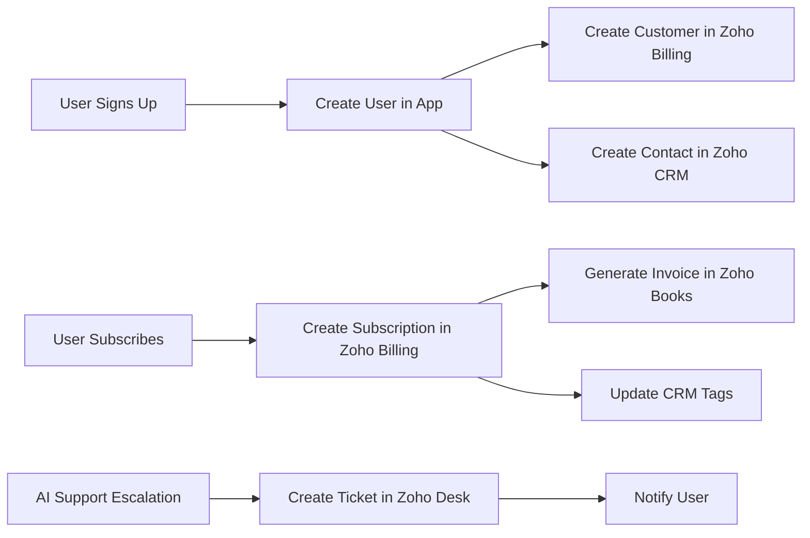

# Zoho Integration Guide

## 1. Introduction

This document provides comprehensive guidance for integrating with Zoho services (Billing, Books, CRM, and Desk). You, the AI agent, must implement these integrations according to this specification.

## 2. Zoho Services Overview

The platform integrates with four Zoho services:

| Service | Purpose | Key Functions |
|---------|---------|---------------|
| Zoho Billing | Subscription and payment management | Create subscriptions, process payments, manage invoices |
| Zoho Books | Accounting and invoicing | Generate invoices, track revenue, accounting reports |
| Zoho CRM | Customer relationship management | Store customer data, track interactions, segmentation |
| Zoho Desk | Customer support ticketing | Create and manage support tickets, escalations |

## 3. Authentication

All Zoho services use OAuth 2.0 for authentication.

### 3.1. OAuth Setup

1.  Create an application in the Zoho Developer Console.
2.  Configure the following OAuth scopes:
    *   Zoho Billing: `ZohoBilling.subscriptions.ALL`, `ZohoBilling.customers.ALL`
    *   Zoho Books: `ZohoBooks.fullaccess.all`
    *   Zoho CRM: `ZohoCRM.modules.ALL`, `ZohoCRM.users.READ`
    *   Zoho Desk: `Desk.tickets.ALL`, `Desk.contacts.READ`
3.  Store the client ID and client secret as environment variables.

### 3.2. Token Management

You must implement a token refresh mechanism:

```typescript
async function refreshZohoToken(service: string): Promise<string> {
  const response = await fetch('https://accounts.zoho.com/oauth/v2/token', {
    method: 'POST',
    headers: { 'Content-Type': 'application/x-www-form-urlencoded' },
    body: new URLSearchParams({
      refresh_token: process.env.ZOHO_REFRESH_TOKEN,
      client_id: process.env.ZOHO_CLIENT_ID,
      client_secret: process.env.ZOHO_CLIENT_SECRET,
      grant_type: 'refresh_token'
    })
  });
  
  const data = await response.json();
  return data.access_token;
}
```

## 4. Zoho Billing Integration

### 4.1. Customer Creation

When a user signs up for the platform, you must create a corresponding customer in Zoho Billing:

```typescript
async function createZohoBillingCustomer(user: User) {
  const response = await fetch('https://billing.zoho.com/api/v1/customers', {
    method: 'POST',
    headers: {
      'Authorization': `Zoho-oauthtoken ${accessToken}`,
      'Content-Type': 'application/json'
    },
    body: JSON.stringify({
      display_name: user.full_name,
      email: user.email,
      phone: user.phone
    })
  });
  
  const data = await response.json();
  return data.customer.customer_id;
}
```

### 4.2. Subscription Management

When a user subscribes to a plan, create a subscription in Zoho Billing:

```typescript
async function createZohoSubscription(customerId: string, planCode: string) {
  const response = await fetch('https://billing.zoho.com/api/v1/subscriptions', {
    method: 'POST',
    headers: {
      'Authorization': `Zoho-oauthtoken ${accessToken}`,
      'Content-Type': 'application/json'
    },
    body: JSON.stringify({
      customer_id: customerId,
      plan: {
        plan_code: planCode
      }
    })
  });
  
  return await response.json();
}
```

### 4.3. Webhook Handling

You must implement webhook handlers for Zoho Billing events:

*   `subscription_created`
*   `subscription_renewed`
*   `subscription_cancelled`
*   `payment_succeeded`
*   `payment_failed`

```typescript
export async function handleZohoBillingWebhook(event: any) {
  switch (event.event_type) {
    case 'subscription_renewed':
      await updateSubscriptionStatus(event.data.subscription.subscription_id, 'active');
      break;
    case 'payment_failed':
      await notifyUser(event.data.customer.email, 'payment_failed');
      break;
    // Handle other events...
  }
}
```

## 5. Zoho Books Integration

### 5.1. Invoice Generation

When a subscription is renewed, an invoice is automatically generated in Zoho Books via the Zoho Billing integration. You can retrieve invoice details:

```typescript
async function getInvoice(invoiceId: string) {
  const response = await fetch(`https://books.zoho.com/api/v3/invoices/${invoiceId}`, {
    headers: {
      'Authorization': `Zoho-oauthtoken ${accessToken}`
    }
  });
  
  return await response.json();
}
```

### 5.2. Revenue Reports

You can fetch revenue reports from Zoho Books for analytics:

```typescript
async function getRevenueReport(startDate: string, endDate: string) {
  const response = await fetch(
    `https://books.zoho.com/api/v3/reports/revenue?start_date=${startDate}&end_date=${endDate}`,
    {
      headers: {
        'Authorization': `Zoho-oauthtoken ${accessToken}`
      }
    }
  );
  
  return await response.json();
}
```

## 6. Zoho CRM Integration

### 6.1. Customer Sync

All application users must be synced to Zoho CRM as contacts:

```typescript
async function syncUserToCRM(user: User) {
  const response = await fetch('https://www.zohoapis.com/crm/v2/Contacts', {
    method: 'POST',
    headers: {
      'Authorization': `Zoho-oauthtoken ${accessToken}`,
      'Content-Type': 'application/json'
    },
    body: JSON.stringify({
      data: [{
        First_Name: user.first_name,
        Last_Name: user.last_name,
        Email: user.email,
        Phone: user.phone,
        Tag: ['App User', 'Active']
      }]
    })
  });
  
  return await response.json();
}
```

### 6.2. Tagging and Segmentation

You must tag CRM contacts based on their subscription status:

*   `Free Tier` - Users on the free plan
*   `Paid Tier` - Users on paid plans
*   `Trial` - Users in trial period
*   `Churned` - Users who cancelled

```typescript
async function updateCRMTags(contactId: string, tags: string[]) {
  await fetch(`https://www.zohoapis.com/crm/v2/Contacts/${contactId}`, {
    method: 'PUT',
    headers: {
      'Authorization': `Zoho-oauthtoken ${accessToken}`,
      'Content-Type': 'application/json'
    },
    body: JSON.stringify({
      data: [{
        Tag: tags
      }]
    })
  });
}
```

## 7. Zoho Desk Integration

### 7.1. Ticket Creation

When the AI support system needs to escalate an issue, it must create a ticket in Zoho Desk:

```typescript
async function createZohoDeskTicket(
  userEmail: string,
  subject: string,
  description: string,
  conversationTranscript: string
) {
  const response = await fetch('https://desk.zoho.com/api/v1/tickets', {
    method: 'POST',
    headers: {
      'Authorization': `Zoho-oauthtoken ${accessToken}`,
      'Content-Type': 'application/json'
    },
    body: JSON.stringify({
      contactId: await getContactIdByEmail(userEmail),
      subject: subject,
      description: description + '\n\n--- Conversation Transcript ---\n' + conversationTranscript,
      departmentId: process.env.ZOHO_DESK_DEPARTMENT_ID,
      priority: 'Medium',
      status: 'Open'
    })
  });
  
  return await response.json();
}
```

### 7.2. Ticket Status Monitoring

You should implement a mechanism to monitor ticket status and notify users when their tickets are updated:

```typescript
async function checkTicketStatus(ticketId: string) {
  const response = await fetch(`https://desk.zoho.com/api/v1/tickets/${ticketId}`, {
    headers: {
      'Authorization': `Zoho-oauthtoken ${accessToken}`
    }
  });
  
  const ticket = await response.json();
  
  if (ticket.status === 'Closed') {
    await notifyUser(ticket.email, 'ticket_resolved', {
      ticketId: ticketId,
      resolution: ticket.resolution
    });
  }
}
```

## 8. Data Flow Architecture



## 9. Error Handling

### 9.1. API Rate Limits

Zoho APIs have rate limits. You must implement exponential backoff:

```typescript
async function zohoApiCallWithRetry(apiCall: () => Promise<any>, maxRetries = 3) {
  for (let i = 0; i < maxRetries; i++) {
    try {
      return await apiCall();
    } catch (error) {
      if (error.status === 429) { // Rate limit exceeded
        const waitTime = Math.pow(2, i) * 1000; // Exponential backoff
        await new Promise(resolve => setTimeout(resolve, waitTime));
      } else {
        throw error;
      }
    }
  }
  throw new Error('Max retries exceeded');
}
```

### 9.2. Webhook Validation

You must validate Zoho webhooks to ensure they are authentic:

```typescript
function validateZohoWebhook(signature: string, payload: string): boolean {
  const crypto = require('crypto');
  const expectedSignature = crypto
    .createHmac('sha256', process.env.ZOHO_WEBHOOK_SECRET)
    .update(payload)
    .digest('hex');
  
  return signature === expectedSignature;
}
```

## 10. Important Constraints

**You must NOT:**

*   Redirect users to Zoho-hosted portals for any customer-facing operations.
*   Expose Zoho API credentials in the frontend.
*   Store Zoho customer IDs without encryption.

**You must:**

*   Keep all Zoho interactions server-side.
*   Implement proper error handling for all Zoho API calls.
*   Log all Zoho API interactions for debugging purposes (without logging sensitive data).
